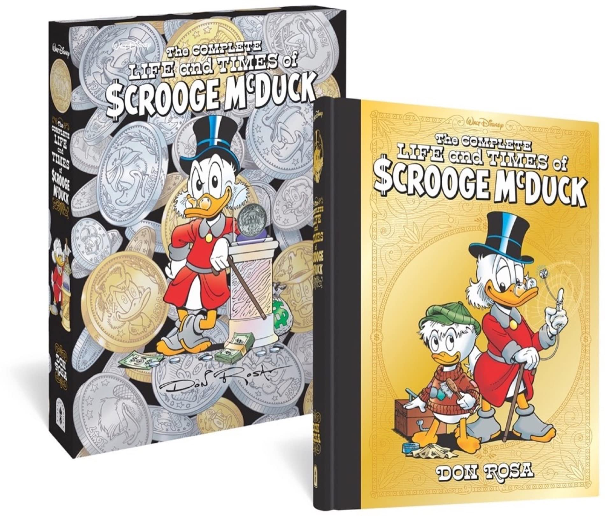
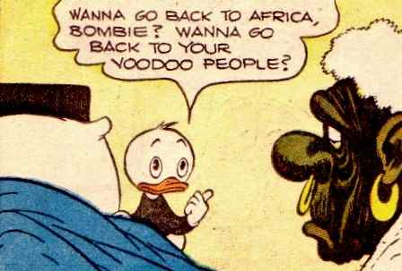
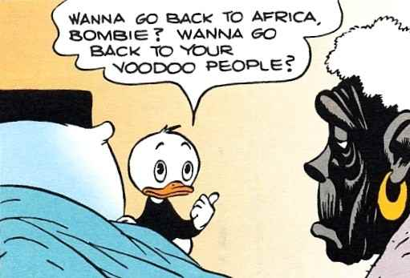
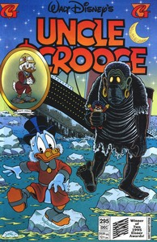
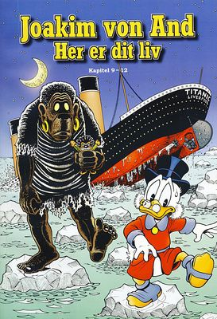
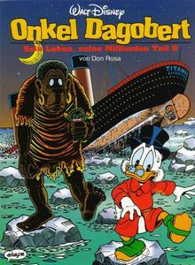
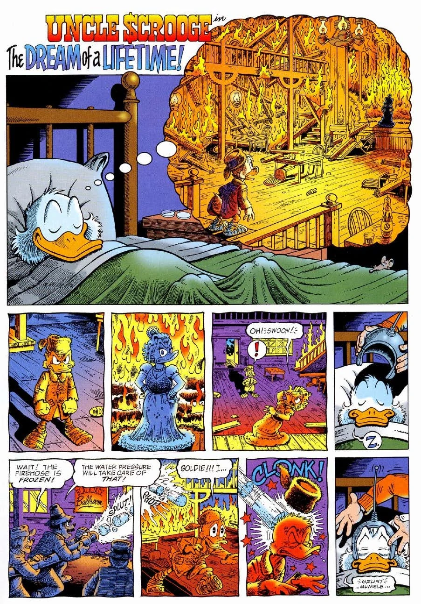

  

《光辉岁月》原版

漫画家当·罗萨（Don Rosa）近日在自己的Facebook个人主页上发表了一篇情况说明，再次回应了之前在粉丝群体中闹得沸沸扬扬的“封杀”事件。在回应中，Rosa透露了出版公司与迪士尼沟通的更多细节，也彻底证实了封杀事件的真实性。也就是说，“鸭迷”们很可能要与鸭漫世界中最负盛名之一的杰作《史高治的光辉岁月》永远说再见了。对全世界的粉丝来说，这无疑是一个令人悲伤的消息。

大约一个多月之前，Rosa就在个人Facebook上发出了出版商的来信，里面提到，迪士尼正在审查过去的漫画故事，由于和公司现在的价值观不合，Rosa的两则经典漫画[《梦中人生》（The Dream of a Lifetime）](https://inducks.org/story.php?c=D+2002-033)和[《世界上最富有的鸭子》（The Richest Duck in The world）](https://inducks.org/story.php?c=D+93288)将不会再版。这在粉丝中引起了轩然大波，之后，围绕着此事的讨论一直在发酵，还有人发起向迪士尼总部的请愿活动———显然，这并没有奏效。正如Rosa在最新回应中的说法，迪士尼的美国总部“对漫画没有兴趣，也不尊重它们”。与迪士尼商业版图中的其他重镇比起来，在如今这个时代，鸭子漫画世界早已式微（尤其在英语世界），不值得为此影响政治正确的大局。

虽然Rosa发布的出版商来信没有明说这两则故事被禁的原因，不过对于粉丝来说，答案是很明显的。这两则漫画的共同点是有Bombie这个古早的角色，他第一次出场还是遥远的1949年，在卡尔·巴克斯（Carl Barks）的故事[《巫毒，巫术》（Voodoo Hoodoo）](https://inducks.org/story.php?c=W+OS++238-02)里，他是个非洲巫医派来追杀史高治的“巫毒僵尸”，给史高治和唐纳德造成了很大麻烦。这种涉及冒犯跨文化群体的形象，在当今的语境下极其敏感。而且在这次事件之前，原版故事重印时，这个角色就遭遇了“净化”，标志性的大鼻头和鼻环被抹去了，原因大概是这种夸张化的描绘涉嫌对特定群体的歧视。所以，在政治正确运动愈演愈烈的今天，事情走到这一步，其实没有那么令人惊讶。

  

  

Bombie形象再版时的改动，来源：cbarks.dk

Barks笔下的原版漫画故事没有过于深入地挖掘角色背后的文化内涵，主要是用这个角色来插科打诨。Rosa后来在《世界上最富有的鸭子》中重新拾起了这个角色，围绕着他增加了一段史高治的前史，丰富了剧情与人物的内涵。在20世纪前20~30年，史高治周游世界淘金时，来到了非洲，他犯下了一生中最后悔的事———在一个村庄，为了金钱，他逼迫原住民离开土地，并放火烧掉了村子。此后，他就一直被部落巫师的诅咒困扰着，Bombie如影随形地跟随他，谴责着他在发家的同时丢掉的良心。这揭示了史高治人生中最黑暗的一面，也引向了在《光辉岁月》结尾时他的忏悔，以及向人性和亲情的回归。这是《光辉岁月》里不可缺少的一笔，用Rosa在这次声明中的原话来说：

>用莎士比亚式的文学术语来说，第11章（注：即本次遭禁的《世界上最富有的鸭子》）是《光辉岁月》的高潮。1~10章是整部传记的“上升动作”（rising action），第11章是高潮，第12章是“回落”（falling action）与最后一幕，给整部传记画下了句号。

  

  

  

首次刊载该故事的各国杂志封面，Bombie追杀史高治，追到了泰坦尼克号上……来源：inducks.org

因此，非常不幸，由于缺少了最关键的高潮部分，《史高治的光辉岁月》大概率将成为绝唱，很难继续出版或者再版了。从Rosa的声明来看，迪士尼对此事的态度与其说是坚决，还不如说是漠不关心。他们没有阅读作品本身，纯粹是从图像符号的角度去看待这个角色的出现，并不关心创作者想通过角色表达的主题，以及对潜在读者群体造成的影响。这让人气愤，也让人无奈。

在一个英文论坛对此事的[讨论贴](https://featherysociety.proboards.com/thread/1558/times-scrooge-mcduck-effectively-banned)里，有人贴出迪士尼近年搞的[“stories matter”](https://storiesmatter.thewaltdisneycompany.com/)活动，它涉及到了很多对他们过去作品中刻板印象的反思，以及相应的修改、下架措施等等。应该说，如果从动机的角度考虑，这样的活动是很有意义的，中国人本身也是这种过去主流娱乐工业刻板印象的受害者群体之一，比如说，很多迪士尼旧漫画中的中国人形象都被描绘成扎清朝辫子，带瓜皮帽的形象。问题是，在执行层面上，至少在这个个案中，我们看到的是一种无知与怕惹麻烦的态度，在这中间并没有对创作者与读者的尊重。

值得读者感到安慰的是，另一个被禁的故事《梦中人生》也许还存在着不被波及的可能。这个故事里，Bombie主要是作为史高治的梦魇客串了一把，一共只在三个格子里出现过。根据Rosa与出版商的讨论，~~在之后的版本中，有可能直接将Bombie变成一团模糊的黑影，这样虽然还是对情节的深度有不少损伤，但可能是妥协之下保住这个故事的唯一方式了。~~（4月16日更新：根据Rosa的最新贴文，似乎这个方案也被迪士尼拒绝了。出版商正在和Rosa合作，讨论新的方案）至于《光辉岁月》，大概在相当长的一段时间内，只能在二手市场上以高价流通了。

  

《梦中人生》,来源：scrooge-mcduck.fandom.com
