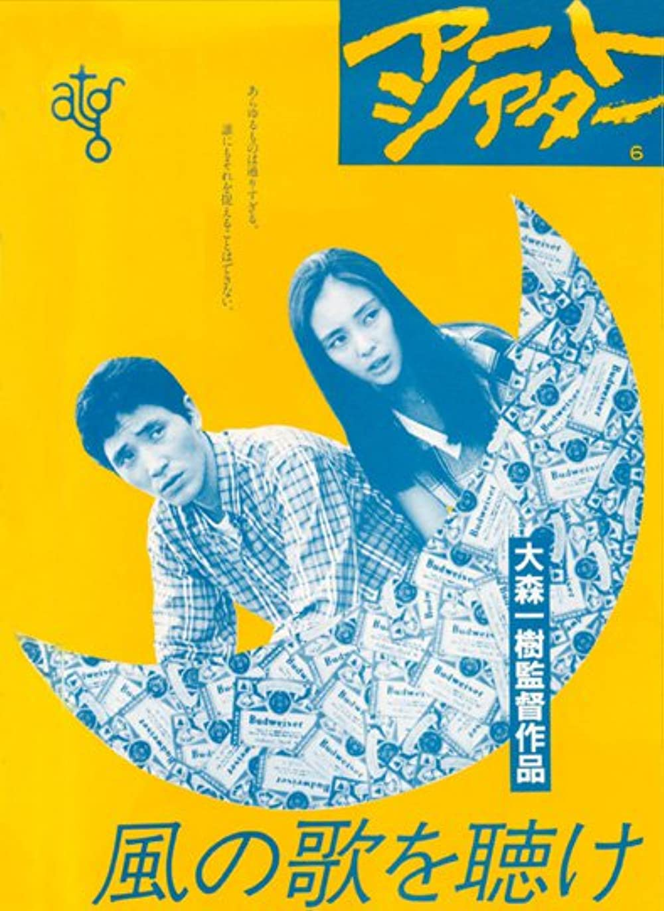
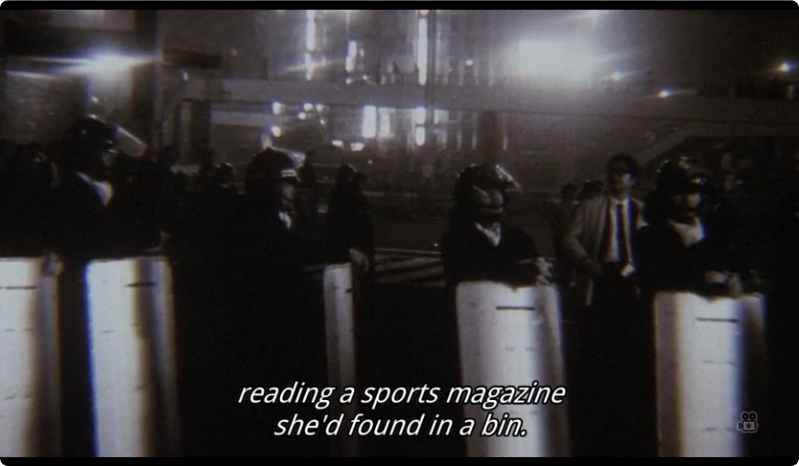
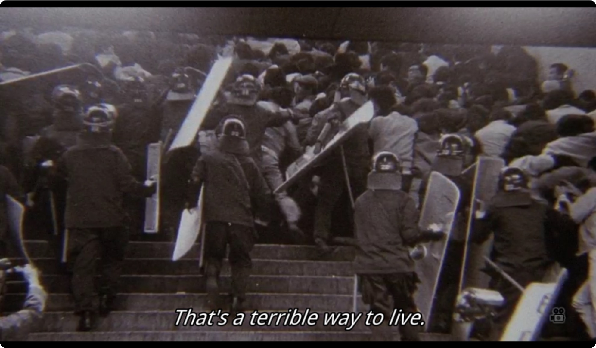
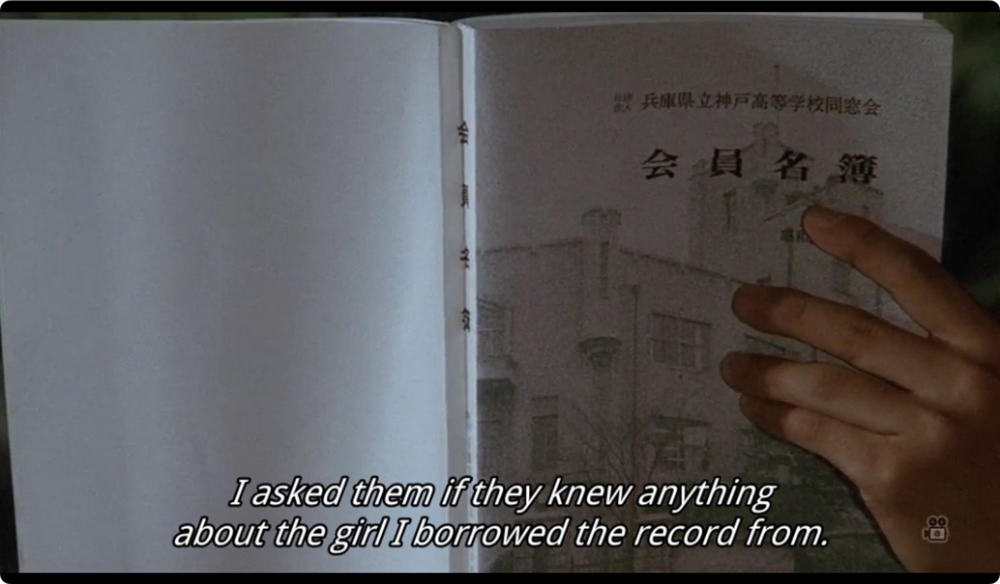
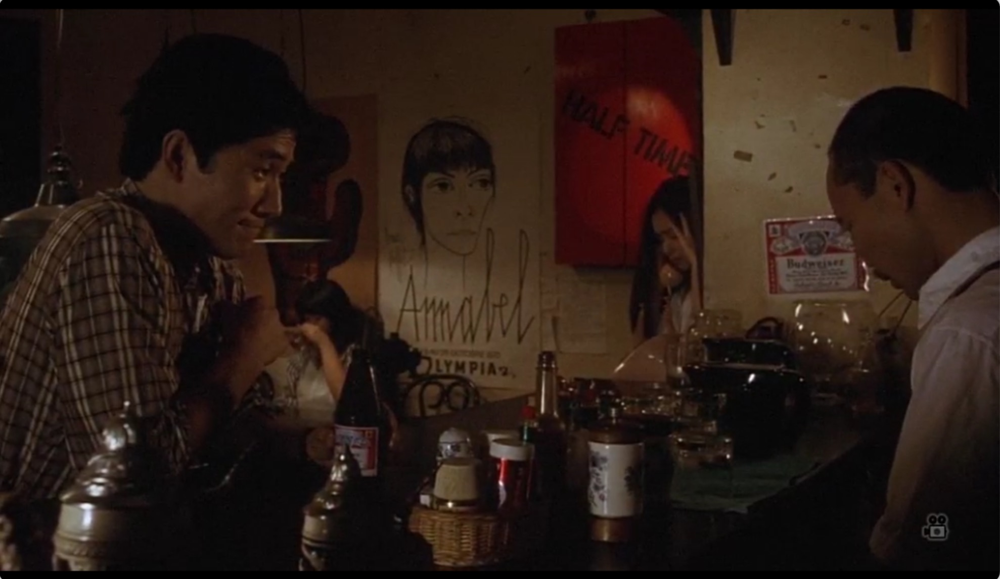
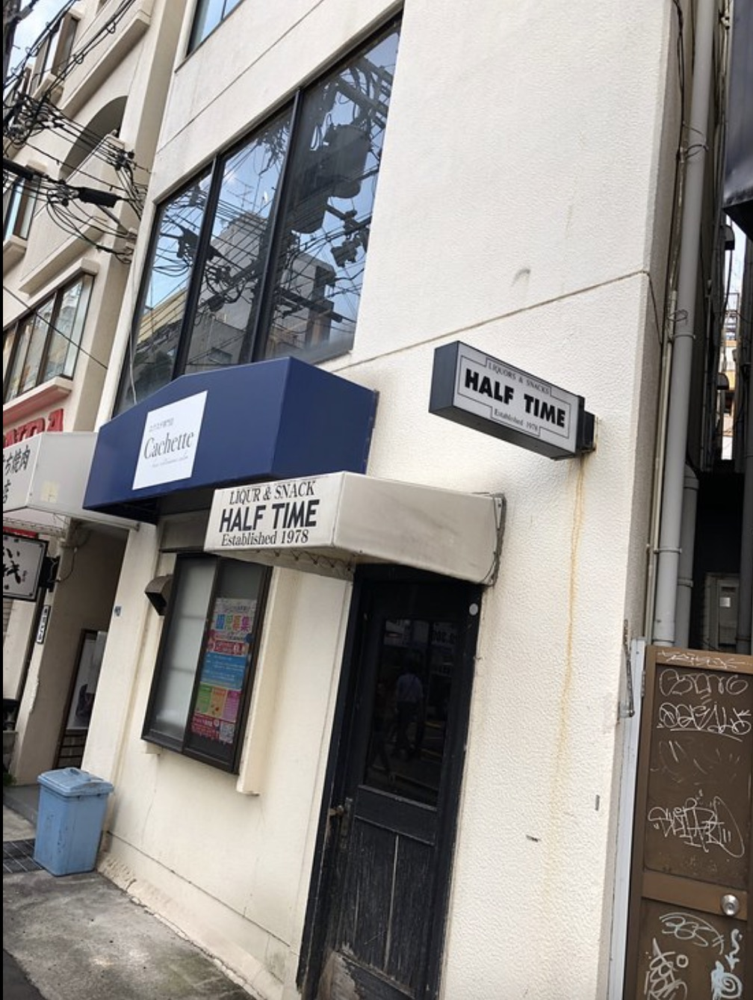
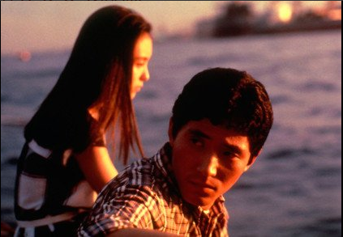

  

来源：IMDB

最近在贴吧看到[有人去了《且听风吟》取景的酒吧](https://web.archive.org/web/20230417020539/https://tieba.baidu.com/p/8336792177)，唤起了一些当年的回忆，关于如何知道有这样一部改编电影，又如何从某个互联网深处的BT种子站将此片拖到硬盘里，然后从另一个地方拖来了英文字幕。在很多中文资料里，这部1982年的电影都是以一个村上小说改编电影失败的模范形象出现的，多半还会补刀说由于这部电影的失败，村上后面就很少授权给导演翻拍他的小说了，等等。

关于村上本人对这部电影的表态，最近一次大概是[在《读卖新闻》上为此片导演大森一树写悼文](https://www.yomiuri.co.jp/culture/cinema/20221209-OYT1T50145/2/)的时候，导演刚过世不久，去年11月12日因白血病去世，终年70岁。他如是说：

<blockquote>
他想把小说《且听风吟》改编成电影，所以来找我，但那时我们两个都还是刚刚起步的阶段。他刚刚拍了《橙色快车》和《希波克拉底们》，正式作为电影导演出道，而我则刚刚出版了处女作《且听风吟》，我们处在类似的人生阶段。我看了《希波克拉底们》，完全被它的新颖与感性所折服。他也喜欢我的书，“这个世界一定只有我能刻画出来”，我们就这样聊开了。因为我们都是在同样的环境下成长的。

在电影《且听风吟》中，大森先生尝试了各种实验性的尝试。他试图描绘与《希波克拉底们》完全不同的世界，积极采用了法国新浪潮的技巧，尽其所能地将我的小说世界搬上了银幕。有些地方达到了预期的有趣效果，但也有一些地方感觉不太协调。我几乎不知道这部作品的社会评价如何，商业成绩如何。我只能大致想象肯定是褒贬不一。

从个人的评价来说，我认为大森先生在这部电影中“不顾前后地”去做自己想做的事情，以及请了真行寺君枝、小林薫、巻上公一这三个个性鲜明的年轻演员，并让他们充满活力地表演，这两点是我最为看重的。关于这部电影，我想说的就是这些。
</blockquote>

从语气上来看，好像这并不是太积极的评价，也许村上不喜欢这部电影的判断其来有自。在找到更具体的资料前，只能说，村上欣赏导演做出的尝试，但大概并不满意成片的效果。不过，至少他指出了一个事实：导演在实验性上对小说有所继承，而且事实上比小说走得更远。这里村上专门点出了新浪潮，我们既看到了它对导演的风格产生的影响，也看到它是如何和村上本人的风格产生共振的———这也正是站在现代性大门口的原著，村上的处女作，继承的遗产之一。我们可以列出一些方面。
- 鲜明的剪辑风格：剧情的连贯性被打乱了，剪辑相当抢戏，定格、闪回、画外音、实景等等频繁出现。
- 政治与社会主题：电影捕捉到了村上原著中那贯穿在行文中的历史残影。原著中遥遥若现，隐隐成为主角PTSD来源之一的“落幕的1968”仅仅是惊鸿一现的阴影，转化为电影中的一段黑白影像后，则更能让观众感性地认识政治动荡对年轻人心灵的影响。在小说结尾，酒吧老板“杰”最后那句轻描淡写却石破天惊的“打仗时，很多人在中国死了”也得以保留，反而是原著中DJ高呼“我、爱、你、们”之类的夏日青春成长式情节被弱化了。导演似乎在刻意加强电影的硬度，而对原著轻盈与怀旧的一端照顾有所不足。这是否是村上对此片不十分满意的原因之一？
- 新演员与业余演员：“鼠”和“杰”分别由音乐人巻上公一与坂田明饰演，饰演“我”的小林薰与饰演四指女孩的真行寺君枝也刚出道不久。事后看，应该说演员略显生涩的表演和原著的主题是契合的。（当然，“杰”一点也不像中国人）

  

  

电影中的社会运动场面

从一个普通观众与读者的角度，我还是认为电影相当好地再现了小说的某种气质，一种干燥无聊，以至于简单到只有一片空白，但又隐藏着某种复杂阴影的气质。正如小说的背景———1970年夏所暗示的那般，场景似乎发生在一个狭窄的KTV包间中，左边隔壁是一群要毕业的年轻人在大吼五月天，右边隔壁是一群陪老板应酬的中年人在低吟陈奕迅，总之都是充满着生命力。与两边的活力四射形成鲜明对比，这个包间里没人唱歌，只是坐在KTV明暗不定的光线下发呆，打瞌睡，没有具体的心思。

在读原著时，我就有一个模糊的认识，虽然小说被蓄意涂抹上了一层超现实的色彩（火星的井，哈特费尔德），但它涉及的核心必然是极其现实的。虽然显得潇洒与疏离，但至少在这篇二十九岁的处女作中，叙述者的心是相当热的，这是一种只能属于处女作的气质。

我有幸找到了[英语世界的粉丝对村上作品的“寻根之旅”](https://murakamipilgrimage.com/hear-wind-sing-pinball-1973/)，他去了村上12岁后生活的兵库县芦屋市，那里有一个立着猴笼的公园，在《且听风吟》中描写“我”与“鼠”半夜开车撞到公园柱子时，作者很可能想到了那里。在那个场景里，作者很突兀地来了一笔“突然从睡梦中惊醒的猴儿们怒不可遏”，如果有原型，自然更好理解了。

  

电影是在神户取景拍摄的，导演也没有打算把拍摄地和剧情设定分割开，电影拍到“我”拿着名册找高中女同学的联系方式时，名册上写着“兵库县立神户高等学校”。严格来说，这一点不是那么符合小说的设定，原著中明确写到城市很小，数万人口，居民生活水准不错，“差不多都住在带有小院的二层楼里”，显然是贴着村上本人度过青春期的芦屋县写的。这大概是一种遗憾，尤其在导演本人和村上都出身于这座城市的情况下。（他们都毕业于芦屋市立精道中学，所以村上给大森的悼词中写到“我们都在同样的环境下成长”）。

<iframe class="space-below" src="https://www.google.com/maps/embed?pb=!4v1681712473234!6m8!1m7!1sdEpqXIT1IEdaeqrZryHV6Q!2m2!1d34.72684744094693!2d135.3158070067462!3f240.52663169999482!4f-6.848550465833554!5f0.7820865974627469" width="600" height="450" style="border:0;" allowfullscreen="" loading="lazy" referrerpolicy="no-referrer-when-downgrade"></iframe>

2022年的芦屋

说回到开头的酒吧，是神户一间名为”half time“的酒吧，电影中可以清晰看见酒吧的真名。从帖子里的照片来看，1978年至今的岁月几乎没有给室内陈设留下太多痕迹，大概是刻意保留复古风格，用来给书迷到此一游与感怀的？至于1978年与小说中1970年日本的爵士酒吧是否存在风格的更替（试想1994年与2002年的北京酒吧，风格必定经过了反复迭代），就只能留待专家考证了。

  

  

酒吧在现代的外观，来源：tripadvisor

如果有时间，我忽然想把久负盛名的《深夜食堂》找来看一看，不知道是否能在小林薰身上找到《且听风吟》中“我”在平成年代的身影。无论如何，感谢创作者在影像化这样一部小说这个艰巨的任务上做出的努力。原始的年代（1970），对原始年代施加影响的年代（1968），文字的年代（1979），影像的年代（1982），一直到今天的回响……如此多重的时空，最后却能凝结在一些年轻与鲜活的脸上，这是难以想象的奢侈。

  

《且听风吟》，神户港，1982
